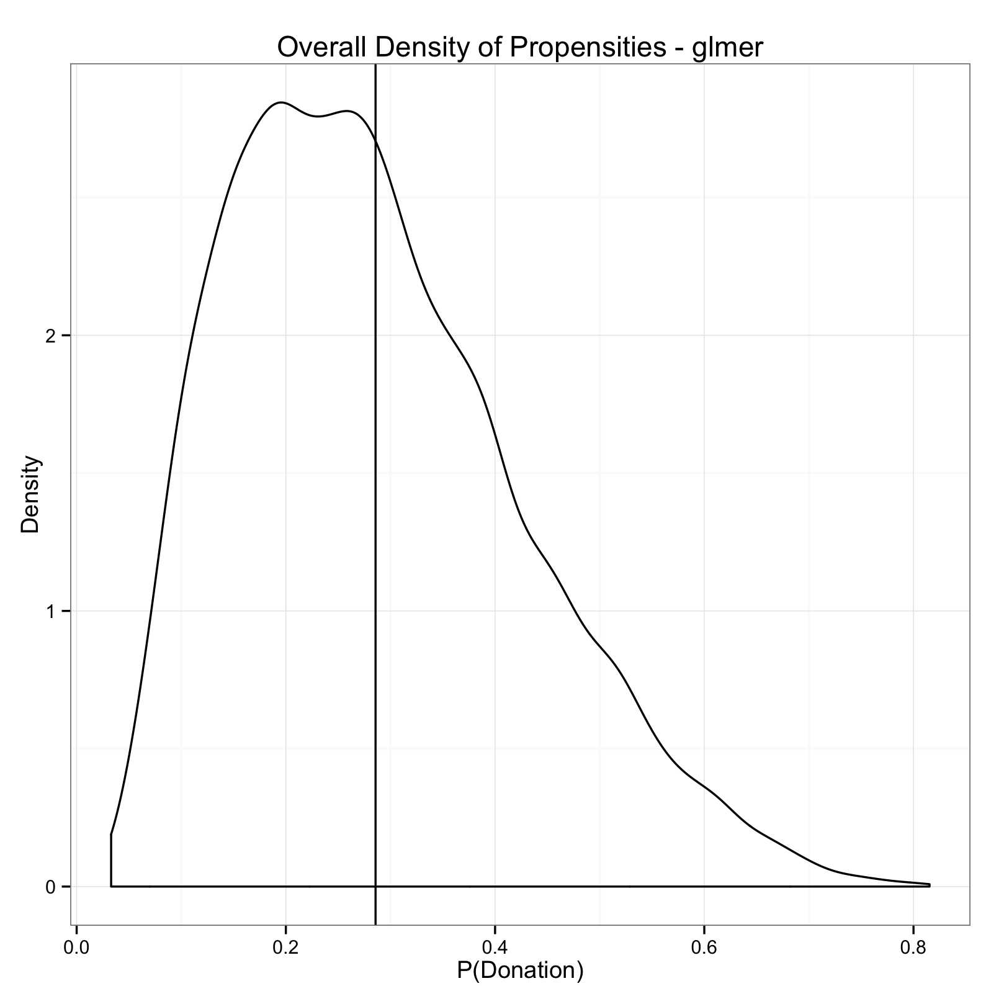
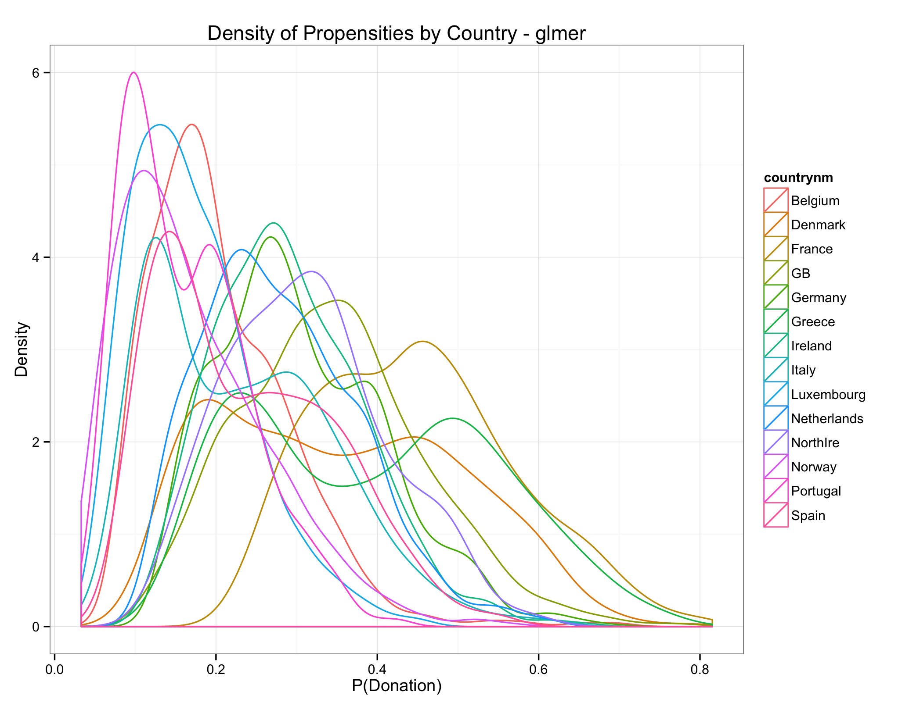
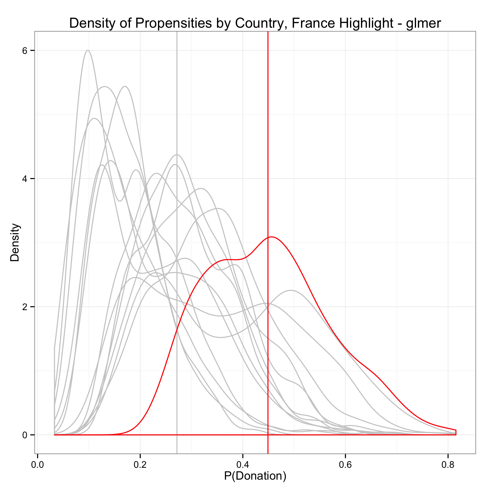
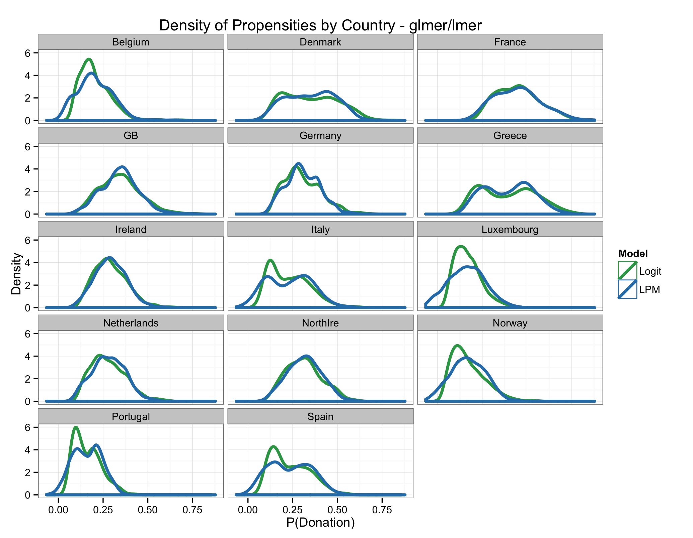
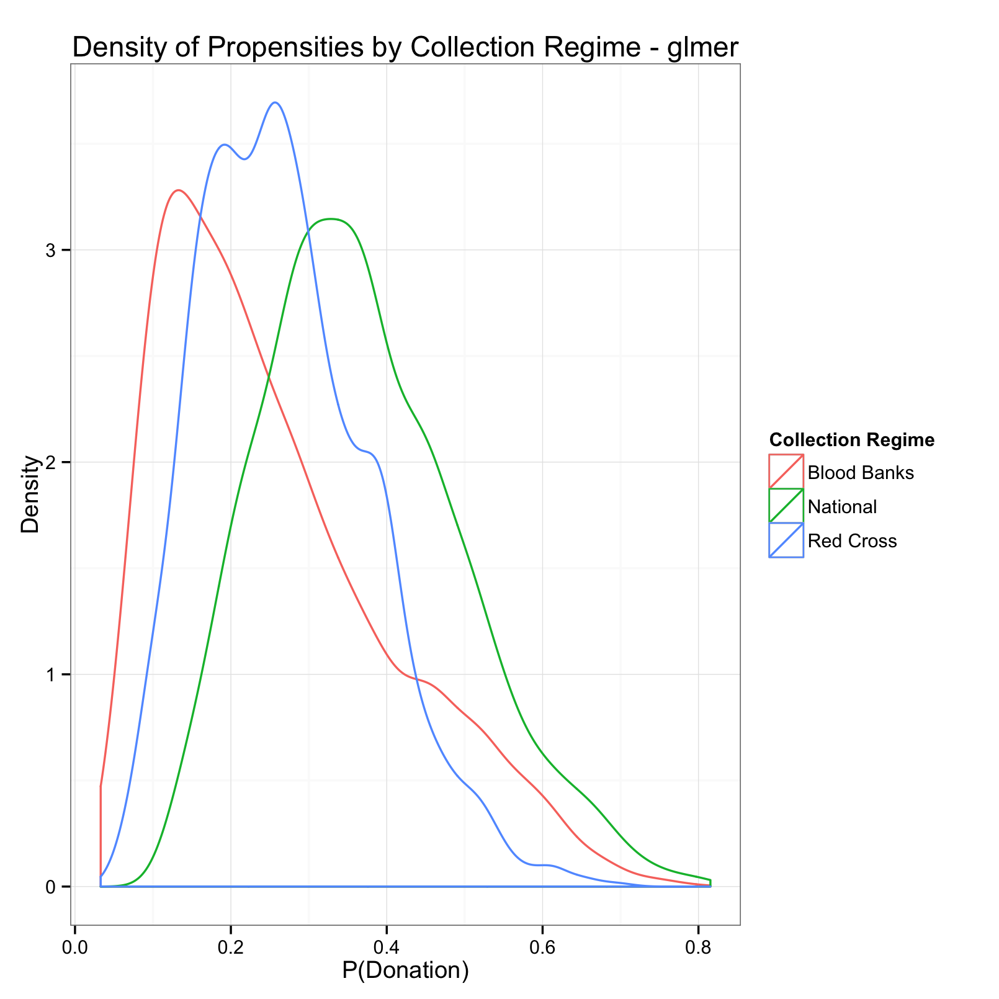
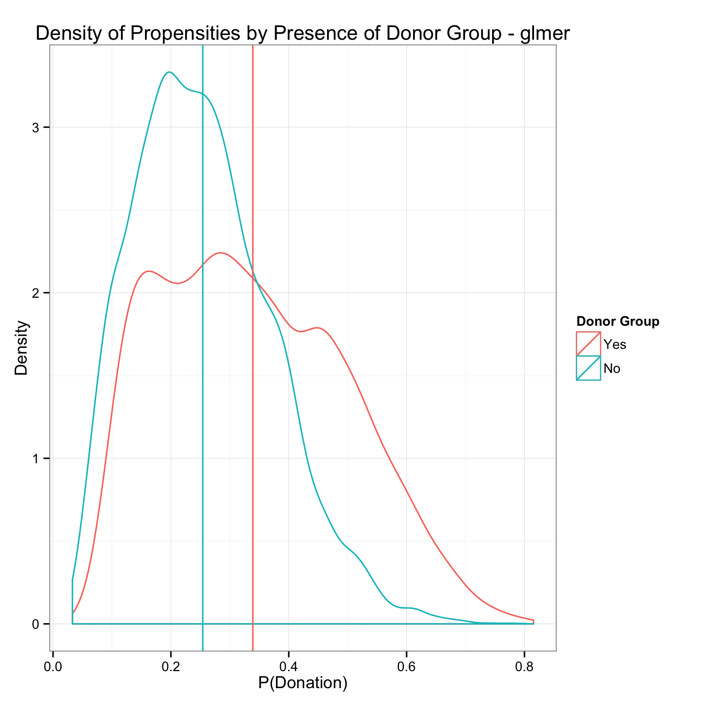
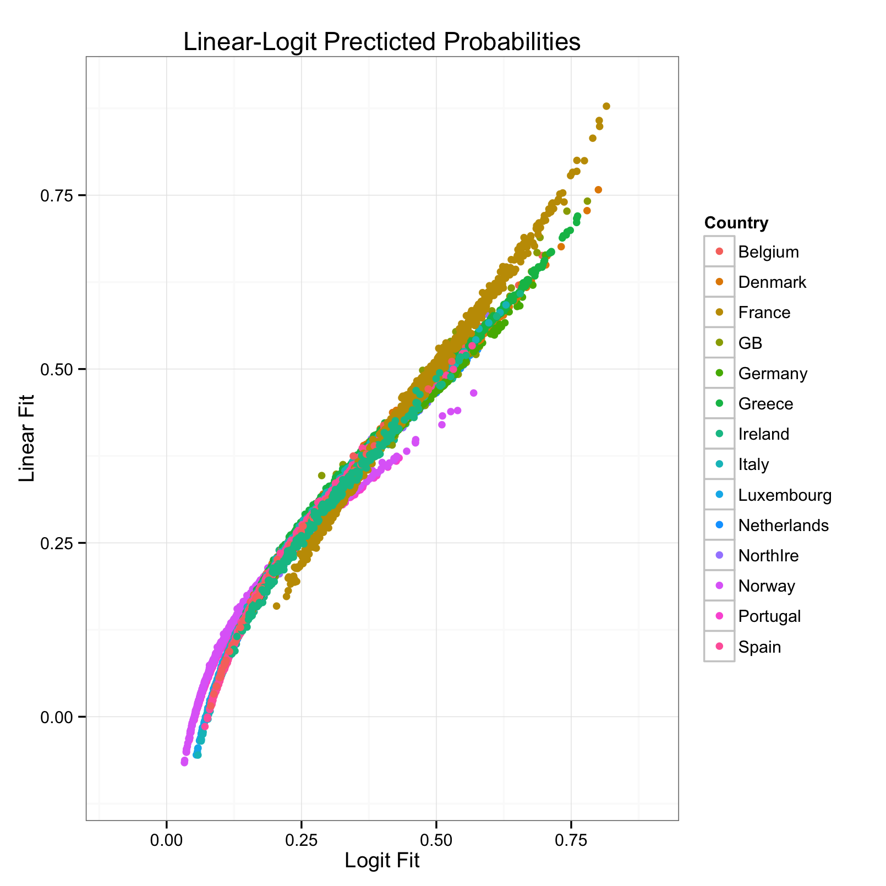
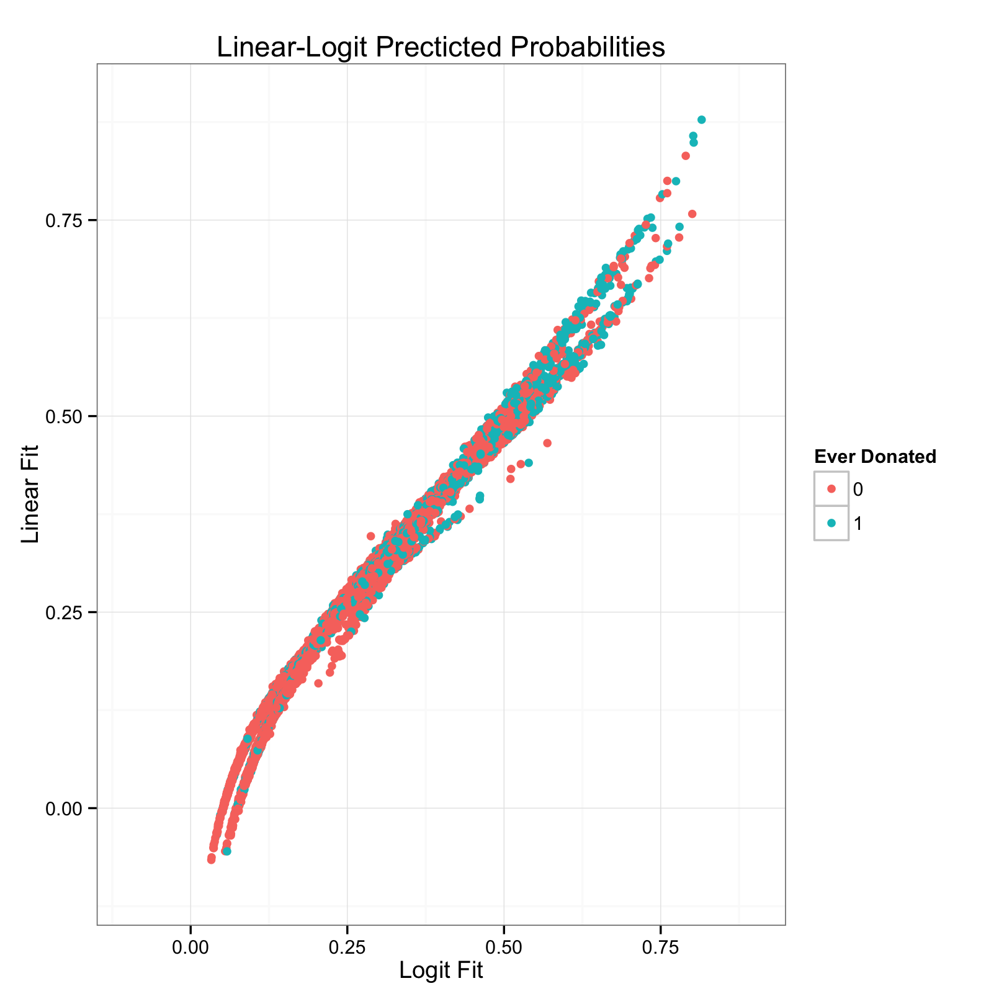

<html>
<head>
<title>Nick Bloom - Models, Models, Everwhere&#33;</title>
<link rel="stylesheet" href="rmd.css">

</head>

<body>

<ul>
<li id="first"><a href="http://nickbloom.net">HOME</a></li>
<li><a href="work.html">WORK</a></li>
<li class="on"><a href="play.html">FUN</a></li>
<!--<li><a href="http://nickbloom.net/blog/">Blog</a></li>-->
<li><a href="vita.html">VITA</a></li>
<li><a href="contact.html">SAY HI</a></li>
</ul>

# Embedded Altruism 2 - Appendix
## More Graphs!

### A Note on the Approach

Many of the graphs below are density plots of propensities, or predicted probabilities. These predicted probabilities are the predicted probabilities calculated by the model for each individual person, *not* the variability of a coefficient's effect *or* the marginal effect of a coefficient.

Instead, I am grouping predicted probabilites by independent variables, and summarizing those groups with densities. I see these density plots as a (very, very) rough estimation of the distribution of latent probability of donating blood within a given group (for example, the country of France). I can't be *sure* that grouping variables are responsible for the different distributions, or that differences between distributions are meaningful. However, I think the plots are useful heuristically to get a better feel for underlying differences in the Eurobarometer population, without making assumptions about the pdf of probability.

### Visualizing the Donor Population

First, let's get a sense of the overall population of donors in the sample:

 

Overall, people aren't very likely to donate blood; the bulk of the predicted probabilities are between 0.1 and 0.4. The vertical line is the mean of the propensities, which is ≈0.286. But, pooling the results like this is probably masking within-country variation. So, let's see how it looks by country:

 

This picture looks more realistic, with densities varying wildly by country. France, in particular, looks like a positive outlier, with most people likely to donate. Let's get a better look:

 

It looks like, on average, people from France are the most likely to give blood. The gray vertical line is the global mean propensity for countries other than France (≈0.272), and the vertical red line is the mean propensity for France (≈0.449). Just for comparison's sake, here are the country-level densities by estimation method:

 

What's interesting (to me at least) is that the country densities follow one of two patterns: 1) normally distributed, or 2) bimodal. The bi-modal countries are generally coastal Mediterranean countries, and probably more importantly, mostly blood bank countries. This complicates interpretation of mean propensities within countries, since it appears the mean is sometimes deceiving.

To get a sense of institutional effects, let's see what these densities look like by collection regime:

 

As predicted in the model, individuals nationally-run blood-collection systems are the most likely to donate, followed by Red Cross, and then Blood Banking regimes. Similarly, donor groups increase overally donation propensity:

 

### Comparisons of Model Fit

 

 

All your blood are belong to us.

</body>
</html>

